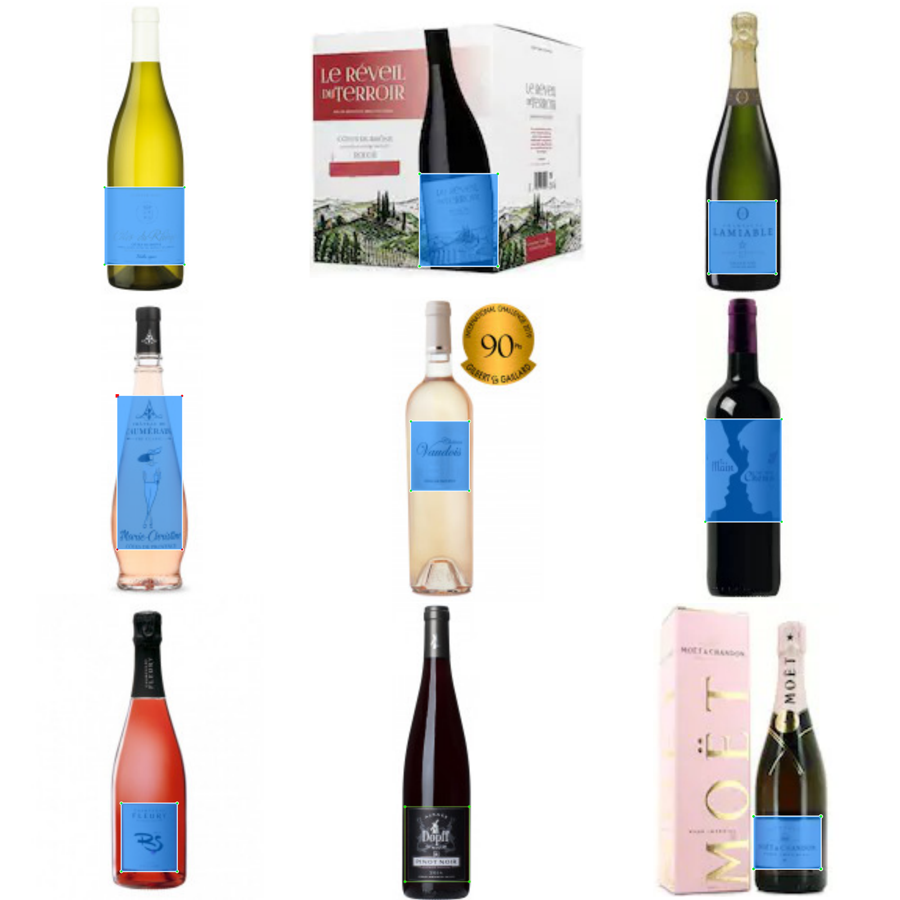

# Wines Labels Dataset

This dataset as been annotated by myself in the Pascal-VOC format using LabelImg.

The dataset is composed of 264 images. Since the dataset is relatively small, it is encouraged to fine-tune a preexisting model with this dataset.

I tried to make this dataset as much mixed as I can by finding differents car angles, colors and shapes.
